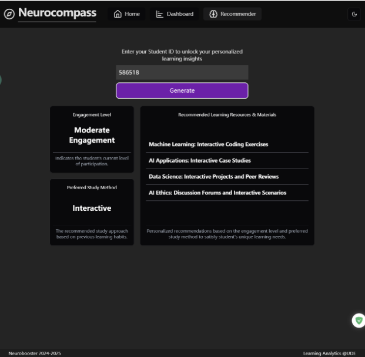
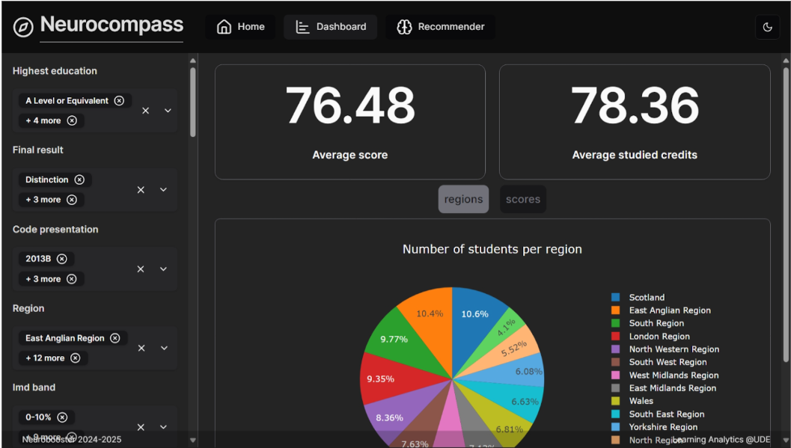
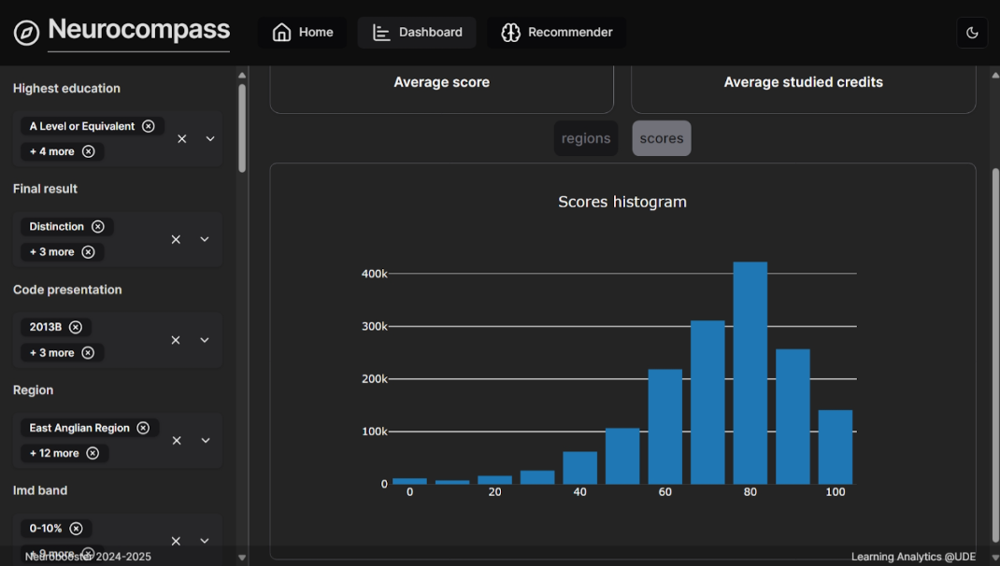

# Neurocompass Web Application

This repository contains the source code for the Neurocompass web application. It is a *monorepo* that contains two packages: `backend` and `frontend`. The `backend` package is a FastAPI application that serves the API for the web application. The `frontend` package is a React application that serves the user interface for the web application.

## Requirements

- [Python 3.11](https://www.python.org/downloads/)
- [Node.js 23.1](https://nodejs.org/en/download/)
- [npm 10.9](https://www.npmjs.com/get-npm)
- [uv](https://docs.astral.sh/uv/) (optional)

All the provided bash commands are for Unix-based systems. If you are using a Windows system, you can use the Windows Subsystem for Linux (WSL) to run the commands, or find the equivalent commands for your system.

## Getting Started

To get started you need to setup the backend and frontend packages. First, clone the repository, then navigate to the `backend` directory and create a virtual environment:

```bash
cd backend
uv venv
source .venv/bin/activate
uv pip install -r requirements.txt
```

To setup the frontend, navigate to the `frontend` directory and install the required dependencies:

```bash
cd frontend
npm install
```

Add the required assets to the `backend/assets` directory. The assets include the models and the dataset. The models should be placed in the `backend/assets/models` directory, and the dataset should be placed in the `backend/assets/data` directory.

To start the backend development server, run the following command inside the `backend` directory:

```bash
source .venv/bin/activate
python3 src/main.py
```

This will start the FastAPI server on `http://localhost:8000`.

To start the React development server, open a new terminal and run the following command inside the `frontend` directory:

```bash
npm run dev
```

This will start the React development server on `http://localhost:5173`. You can now navigate to `http://localhost:5173` in your browser to view the web application.

## Initializing the Database

After adding the files `merged_df.csv` and `processed_data.csv` to the `backend/assets/data` directory, you can initialize the database by running the python script in the `backend/Scripts` directory:

```bash
cd backend
python3 Scripts/import_csv.py
```

You only need to run this script once to initialize the database. (It takes a while to run)
# **NeuroCompass-Navigating Learning through Data Visualization and Smart Recommendation**  

## **Project Description**  
Student engagement is a critical factor in academic success, especially for off-campus learners. This project aims to analyze student interactions, demographics, and course details to identify patterns that influence engagement and performance. By leveraging machine learning techniques, we seek to provide personalized learning recommendations that enhance student outcomes.  

## **Objective**  
The primary objective of this project is to recommend effective resources and materials that improve student engagement and success. By analyzing student interaction data, we aim to develop insights that facilitate tailored learning experiences, ensuring better academic performance and retention.  

## **Dataset**  
We utilize the **Open University’s Virtual Learning Environment (VLE) dataset**, which includes:  
- **Demographic information** (age, gender, prior education, etc.)  
- **Course details** (modules, assessments, learning activities)  
- **Student interactions** (logins, clicks, resource usage, forum participation)  

## **Approach**  
Our approach is data-driven and involves:  
1. **Data Preprocessing & Exploration** – Cleaning, structuring, and visualizing engagement trends.  
2. **Feature Engineering** – Extracting key features influencing student success.  
3. **Model Development** – Applying machine learning models such as decision trees, random forests, and neural networks to predict engagement and performance.  
4. **Recommendation System** – Generating personalized learning material suggestions based on predictive insights.  
5. **Evaluation & Optimization** – Measuring model accuracy and refining recommendations for better results.  

## **Goal**  
The ultimate goal is to **create personalized, data-driven learning experiences** for off-campus students, improving engagement, academic success, and retention rates. By identifying at-risk students early, institutions can intervene with targeted support strategies, ensuring a more inclusive and effective learning environment.  


## **Features / Attributes**

### **1. Student Information (`studentInfo.csv`)**
- **Demographic Details**:
  - `gender`
  - `region`
  - `highest_education`
  - `imd_band` (socio-economic status)
  - `age_band`
  - `disability` status
- **Academic Background**:
  - `num_of_prev_attempts` (number of previous attempts)
  - `studied_credits`
  - `final_result` (student's outcome in the course)

### **2. Course Information (`courses.csv`)**
- **Course Details**:
  - `code_module` (course identifier)
  - `code_presentation` (presentation period)
  - `module_presentation_length` (duration of the module in days)

### **3. Assessment Information (`assessments.csv` and `studentAssessment.csv`)**
- **Assessment Details**:
  - `id_assessment`
  - `assessment_type` (e.g., TMA, CMA, Exam)
  - `date` (scheduled date of assessment)
  - `weight` (contribution to the final grade)
- **Student Assessment Records**:
  - `date_submitted`
  - `is_banked` (indicates if the assessment result is banked)
  - `score` obtained by the student

### **4. Virtual Learning Environment (VLE) Interactions (`vle.csv` and `studentVle.csv`)**
- **Resource Information**:
  - `id_site` (identifier for the resource)
  - `activity_type` (type of resource, e.g., forum, quiz)
  - Availability periods (`week_from`, `week_to`)
- **Student Interaction Data**:
  - `date` (interaction date)
  - `sum_click` (number of times a student interacted with a resource on a given date)




## **Technical Architecture**

### **1. Data Collection Layer**
- Extracts student demographics, course details, assessments, and VLE interactions from OULAD.
- Sources: CSV files (`studentInfo.csv`, `courses.csv`, `assessments.csv`, `studentVle.csv`, etc.).

### **2. Data Preprocessing & Feature Engineering**
- Handles missing values, normalizes data, and encodes categorical attributes.
- Extracts meaningful features such as study habits, assessment scores, and engagement metrics.

### **3. Model Training & Development**
- Implements machine learning models to predict student engagement and success.
- Techniques used:
  - Decision Trees
  - Random Forests
  - Collaborative Filtering (Matrix Factorization)
  - Deep Learning (Neural Networks for personalized recommendations)

### **4. Recommendation Engine**
- Generates personalized learning paths based on model predictions.
- Suggests relevant courses, resources, and interventions for at-risk students.

### **5. Evaluation & Optimization**
- Evaluates model performance using metrics like Accuracy, RMSE (for regression), and Precision-Recall (for recommendations).
- Fine-tunes hyperparameters and retrains models based on student feedback and new data.

### **6. Deployment & User Interface**
- Deploys the recommendation system as a web or API-based service.
- Provides an interactive dashboard for students and educators to visualize insights and personalized suggestions.


## Resources

- [FastAPI Guides][fastapi]
- [React Guides][react]
- [React Router Documentation][react-router]
- [Vite Guides][vite]
- [UV Documentation][uv]
- [PlotlyJS Documentation][plotlyJS]
- [Shadcn Documentation][shadcn]

# Technologies, Libraries, and Algorithms Used

## Technologies
- Jupyter Notebook: Used for code execution, visualization, and documentation.
- Pandas DataFrames: Used for data manipulation, merging, and preprocessing.
- Plotly Dash / Tableau: Used for interactive data visualization and reporting.

## Libraries
- Data Handling & Processing:
    - pandas: For data manipulation and merging multiple tables.
    - numpy: For numerical computations and array operations.

- Data Visualization:
    - matplotlib: For static visualizations such as histograms and boxplots.
    - seaborn: For statistical visualizations, heatmaps, and correlation plots.
  
- Machine Learning:
  - scikit-learn: Provides tools for classification, clustering, regression, dimensionality reduction, feature engineering, and model selection.
  
## Algorithm - Classification in Machine Learning
### Data Analysis & Preprocessing
- Descriptive Statistics: Summarizes dataset features.
- Data Merging: Uses composite keys (id_student, code_module, code_presentation).
- Handling Missing Data: Imputation or removal of missing values.
  
### Feature Engineering
- Map raw date into features
- Two main features: Student study method frature and student engagement feature
    
### Scaling & Normalization: prepares data for ML
- One-Hot Encoding: Converts categorical feetures into 0 or 1.
- MinMaxScaler: Converts numerical features into [0,1]
  
### Choosing Machine Learning Models
- Classification: predict the class of student study method
 - Support Vector Classification (SVC)
 - Gradient Boosting
 - Decision Tree
   
### Evaluation models
- Compare the accuracy, precision and recall beteewn different models (compare classification performance)
- Confusion Matrix (Analyzes classification results)
- Finally choose Gradient Boosting because of its best performance
  
### Recommendation System
- Based on the ML prediction(student study method preference) and student study engagement feature to recommend some learning recourses

## Visuliazation
### Pie Chart

- It shows the academic performance and regional distribution of different student groups.

### Histogram

- It allows users to filter data based on various factors (such as highest education, final result, course code, region, and socioeconomic background) and view the score distribution of specific student groups. It helps teachers analyze which score ranges have the most students in order to develop more effective learning resource recommendations.
  

## Common issues and solutions

### Connection refused to mongodb

If you are running the mongoDB server on windows, and running the backend on WSL, you may encounter a connection refused error. To fix this, you need to change the `bindIp` in the `mongod.conf` file to `0.0.0.0`. 
[See this article][article1]

<!-- References -->
[fastapi]: https://fastapi.tiangolo.com/tutorial/
[react]: https://reactjs.org/docs/getting-started.html
[react-router]: https://reactrouter.com/start/library/installation
[vite]: https://vitejs.dev/guide/
[uv]: https://docs.astral.sh/uv/
[plotly]: https://plotly.com/python/
[plotlyJS]: https://plotly.com/javascript/react/
[shadcn]: https://ui.shadcn.com/docs

[article1]:https://medium.com/@uncledev/how-to-connect-a-project-running-wsl-to-mongodb-running-on-windows-609bb7a6e1e8
